<div align="center">


# TrinoHub

**Self-hosted AWS control plane for running Trino SQL clusters from the browser.**

Provision and operate EC2-backed Trino clusters, wire up data catalogs, and run SQL —
all from one box, with no static AWS credentials and a Trino-aware autoscaler.

<sub>MANAGED TRINO CLUSTERS · FastAPI + boto3 + SQLite · managed-platform workflow, original implementation</sub>

**[trinohub.org](https://trinohub.org)** · [GitHub](https://github.com/BitRefinery/trinohub)

</div>

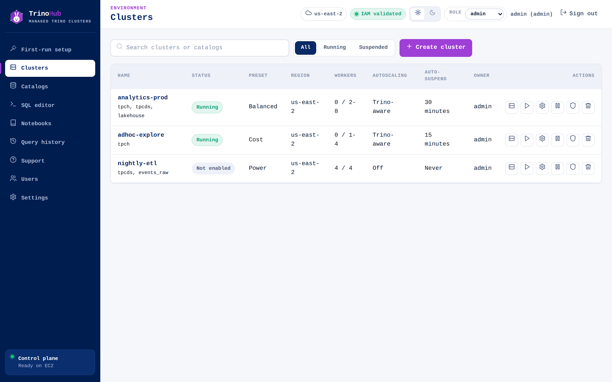

---

## What is TrinoHub?

TrinoHub ships as a **control-plane AMI**: a single EC2 instance running the TrinoHub
UI + API, a local SQLite database, and an AWS orchestration service. It installs **into your
own VPC**, so clusters and query data stay inside your AWS account — nothing routes through a
TrinoHub-hosted service. From that one box, operators launch and manage **separate EC2-based
Trino coordinator/worker clusters** and data catalogs. Analysts pick a cluster, write SQL, and
pull results.

It replaces the "spin up Trino by hand with Terraform/Ansible" workflow with a few clicks
and a Trino-aware autoscaler — while keeping the security model tight: the control plane
authenticates to AWS via its **EC2 instance profile** (no access keys, ever), and cluster
nodes fetch signed, per-cluster bootstrap config over the private network.

**Two roles, one app:**

| Role | What they do |
|---|---|
| **Admin / platform engineer** | First-run setup, validate AWS IAM, create/operate clusters and catalogs, manage users, review settings. |
| **Analyst / query user** | Pick a cluster + catalog, run SQL, watch query status, cancel their own queries, download CSV, browse their own history. |

---

## Highlights

- **Cluster lifecycle from the browser** — create, start/resume, suspend, disable, and delete
  EC2-backed Trino clusters. Each cluster maps to a tagged set of AWS resources (coordinator
  EC2, worker launch template, worker Auto Scaling Group, security-group rules). **Delete
  terminates every tracked resource.**
- **Preset tiers** — `Cost` / `Balanced` / `Power` resolve to region-available M-family
  instance types (`m7i.large` / `m7i.xlarge` / `m7i.2xlarge`, with prior-generation fallbacks).
- **Trino-aware autoscaling** — a control loop (not a raw CPU policy) that scales workers on
  queued queries and CPU, with cooldowns and min/max bounds. **Auto-suspend** tears down idle
  clusters; a query against a suspended cluster resumes it first.
- **Catalogs** — built-in `system`, `tpch`, `tpcds`, plus **S3 + AWS Glue (Iceberg)** data
  sources configured by warehouse location, region, schema, and read/write intent. Worker IAM
  roles grant S3/Glue access — **TrinoHub never stores S3 access keys.**
- **Accelerated clusters (object-store caching)** — optional warm cache for S3-backed catalogs
  (Hive, Iceberg, Delta Lake) built on Trino's file system cache: nodes keep hot data pages on
  local NVMe instance-store SSDs and the scheduler routes work to the nodes that already hold
  the file, so repeated scans read from local disk instead of S3. Toggle **Accelerated** at
  cluster create with an NVMe instance type (`i4i` / `r6id` / `i3en`) — see
  [`docs/accelerated-clusters.md`](docs/accelerated-clusters.md).
- **SQL editor** — schema browser, cluster/catalog/schema selectors, live status polling,
  tabular results, error display, and CSV export. Browser results cap at 1,000 rows / 10 MB;
  CSV export streams a larger capped buffer.
- **Notebooks** — organize SQL into an ordered document of cells (Jupyter/Databricks-style,
  scoped to Trino). Each cell runs independently with its own inline table **or chart**,
  supports per-cell cluster/catalog/schema overrides, reorder, **Run all**, and per-cell CSV.
  Notebooks autosave to your account.
- **Security by default** — instance-profile auth, allowed-UI-CIDR enforcement at the app
  layer, signed per-cluster bootstrap tokens, hashed passwords, and httpOnly session cookies.
- **Polished UI** — purple/blue design system, light/dark themes, and responsive layouts down
  to phone widths (operators check clusters on the go).

---

## Screenshots

### Cluster detail — metrics, cost, resource map, and live utilization
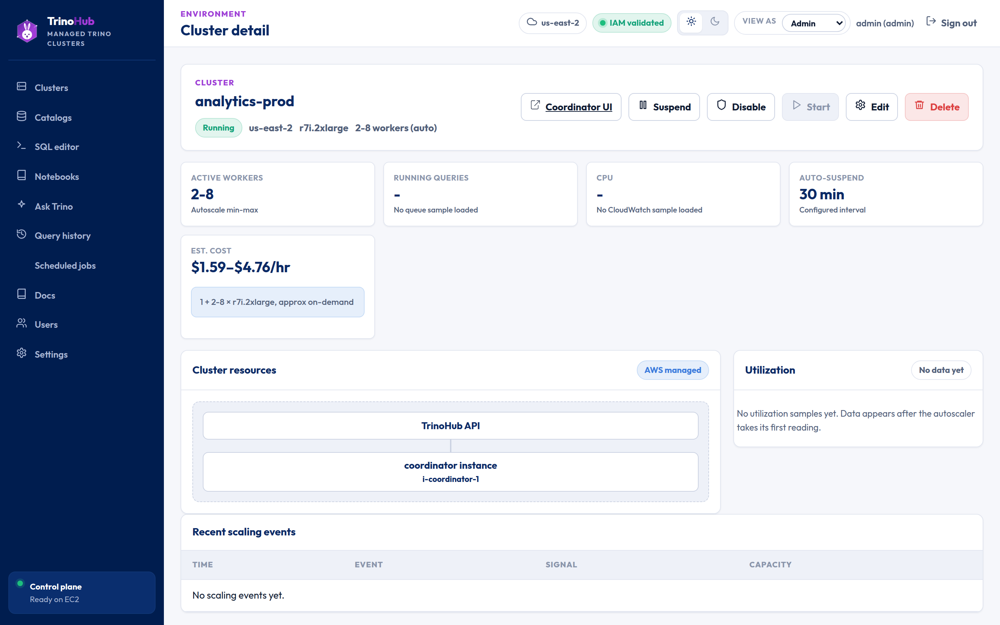

### Create / edit cluster — preset tiers, autoscaling, and a sticky review panel
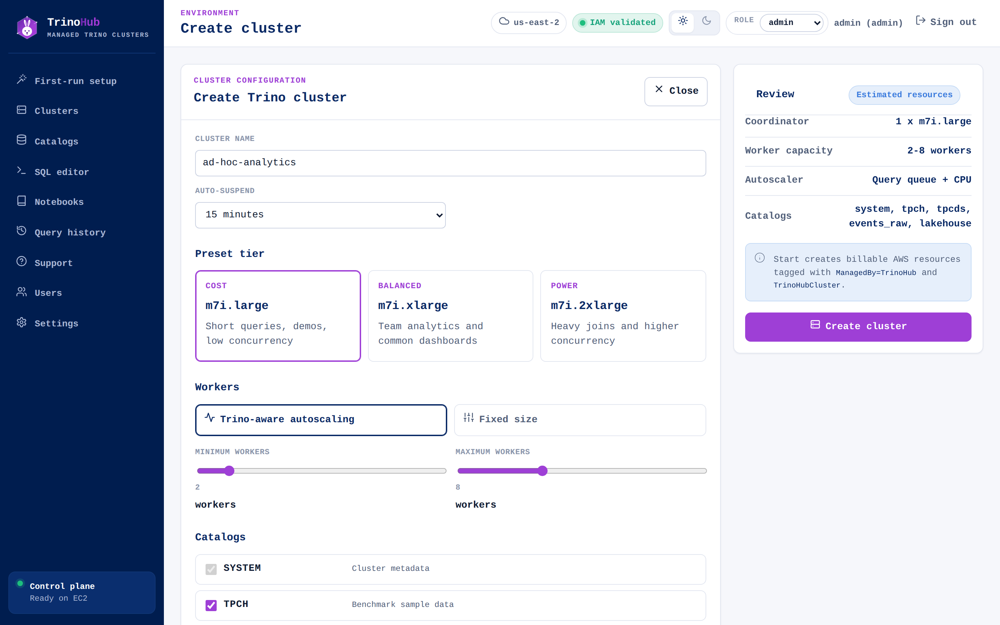

### SQL editor — schema browser, syntax highlighting, results, and recent queries
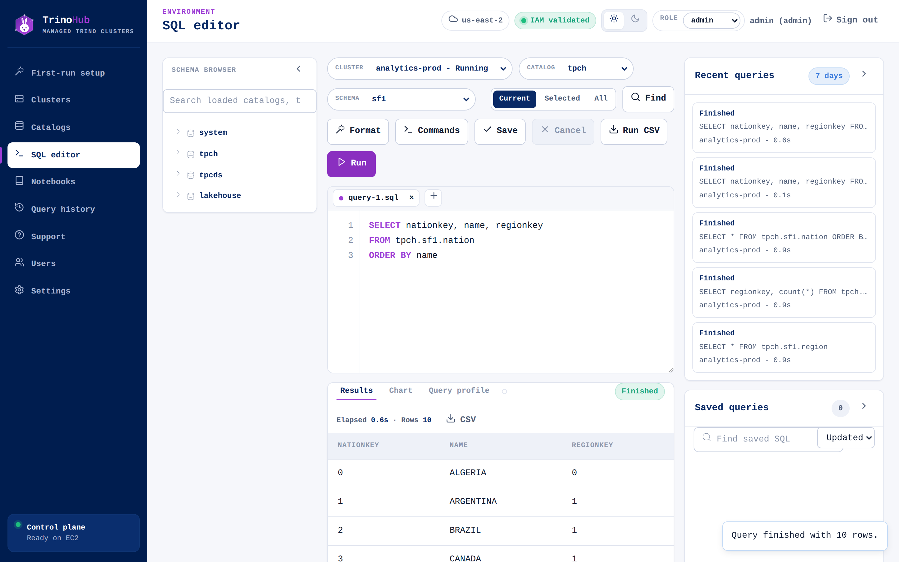

### Notebooks — ordered SQL cells with inline tables and charts
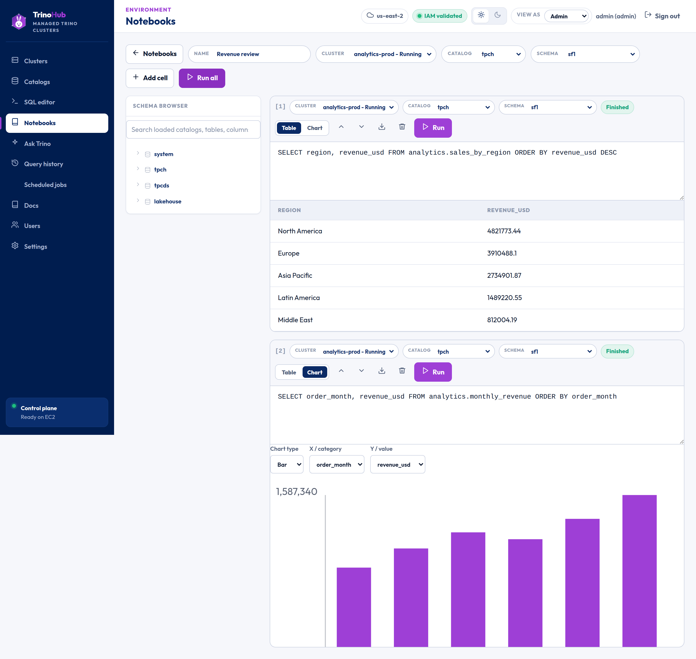

### Catalogs — built-ins plus S3 + Glue Iceberg data sources
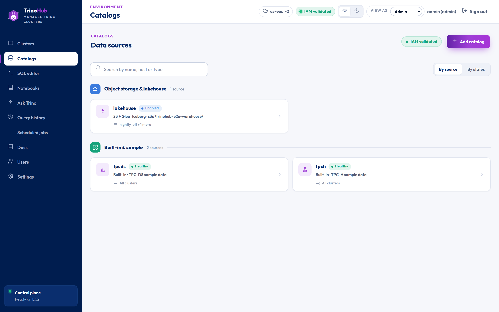

### Query history — per-user recent runs with status, cluster, elapsed, and rows
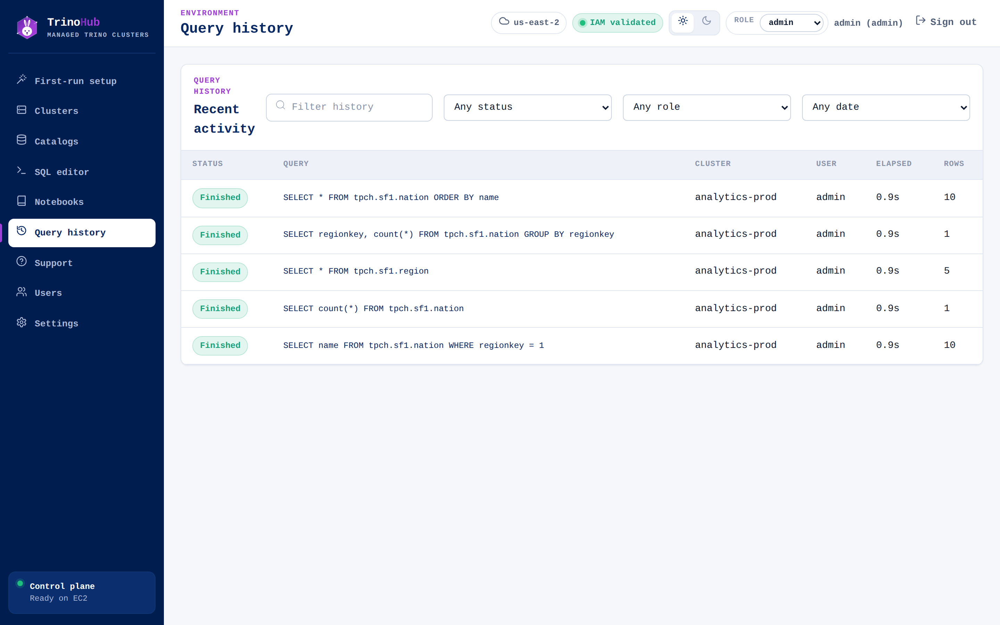

### Users — local accounts with admin / query-user roles
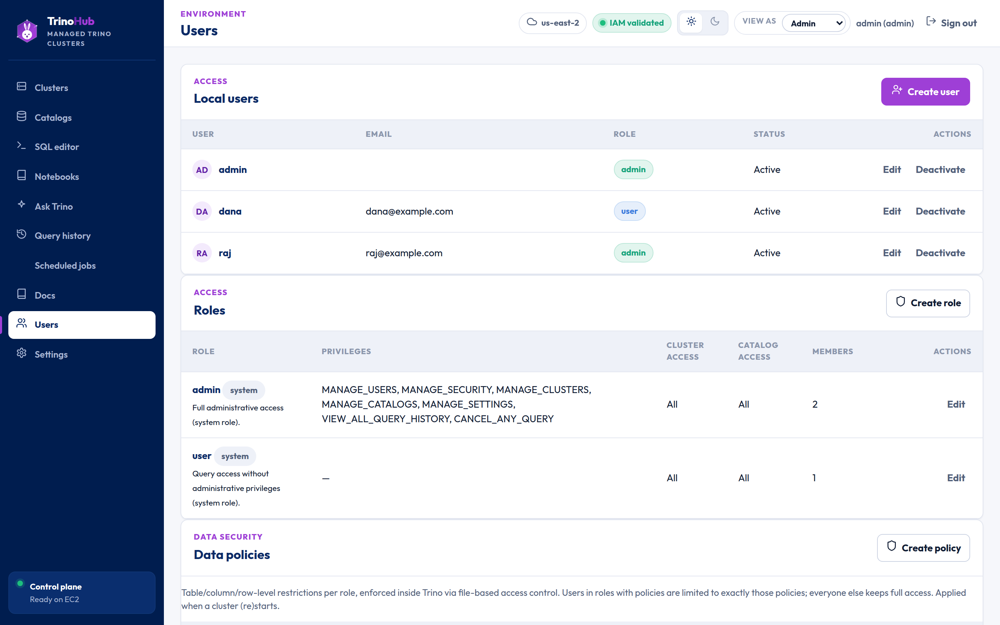

### Settings — AWS configuration, resolved preset tiers, and OpenAPI links
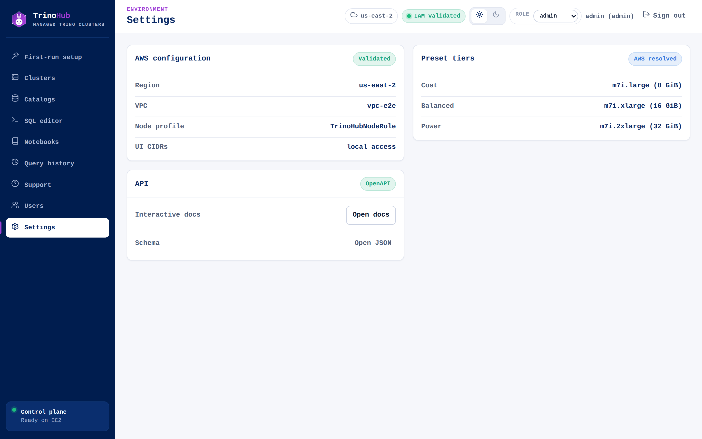

### Sign in & dark mode
| Sign in | Dark theme |
|---|---|
| 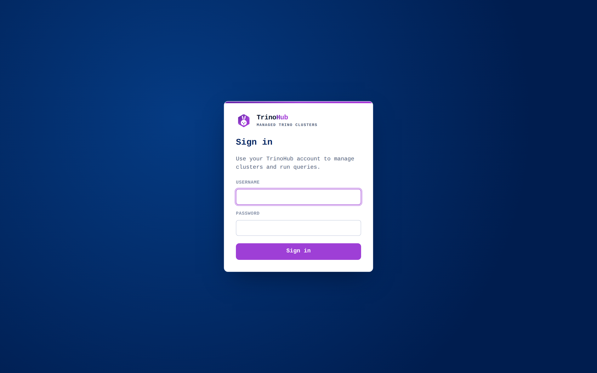 | 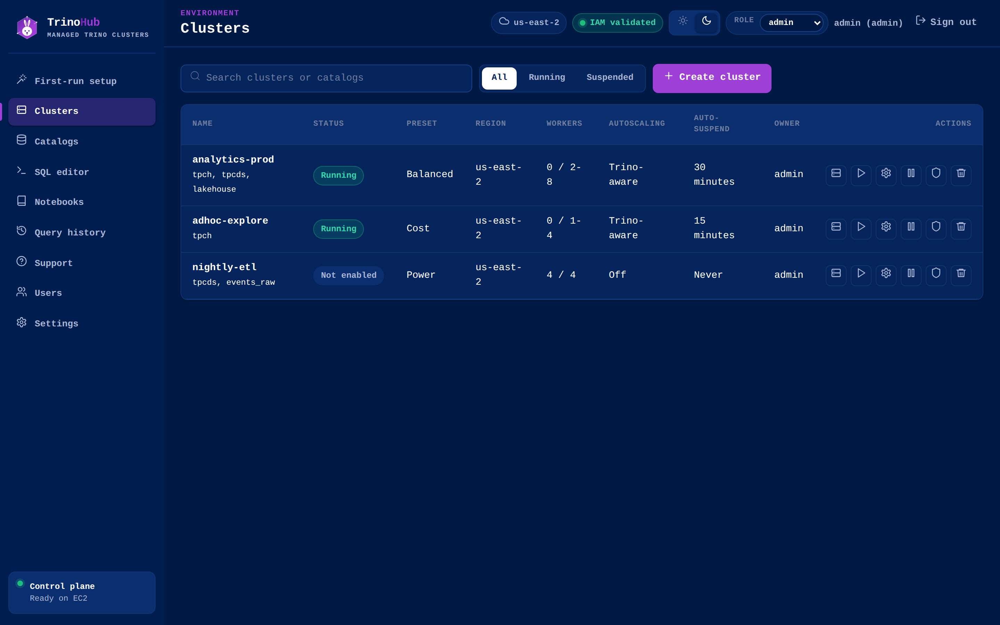 |

---

## Architecture

```
                ┌──────────────────────── Control-plane EC2 (the "AMI") ───────────────────────┐
   Browser ───► │  FastAPI app (trinohub/api.py)  ──►  TrinoHubApp business logic (server.py)  │
   (static UI)  │      static UI (web/)                  SQLite (.trinohub/trinohub.sqlite3)    │
                │      OpenAPI docs (/docs)              boto3 → AWS (EC2, ASG, STS, CloudWatch) │
                └───────────────┬──────────────────────────────────────────────────────────────┘
                                │  provisions + bootstraps (tagged, instance-profile auth only)
                                ▼
                ┌──────────── Per-cluster AWS resources ────────────┐
                │  Coordinator EC2  ──►  Workers Auto Scaling Group  │
                │  Launch template · Security group · Boot tokens    │
                └────────────────────────────────────────────────────┘
```

| Layer | Choice |
|---|---|
| API | **FastAPI** (`trinohub/api.py`); OpenAPI docs at `/docs`; stdlib `TrinoHubApp` (`trinohub/server.py`) holds business logic. |
| AWS | **boto3** — EC2, Auto Scaling, STS, CloudWatch (read). |
| Storage | **SQLite** (`.trinohub/trinohub.sqlite3`) — users, sessions, setup, clusters, catalogs, query runs, events. |
| Frontend | **Static HTML/CSS/JS** in `web/` — no build step, browser-native. |
| Deploy | systemd unit + nginx config under `deploy/`; runs `uvicorn trinohub.api:app`. |

---

## Install

TrinoHub provisions real AWS infrastructure, so the intended way to run it is **on
AWS in your own account**. A local install is available for development.

### Deploy on AWS (recommended)

A single CloudFormation stack creates the IAM roles (instance-profile auth — **no
static keys**), a security group, and an EC2 instance that installs and starts the
app. From there you launch and manage Trino clusters in the browser.

```bash
aws cloudformation deploy \
  --stack-name trinohub \
  --template-file deploy/aws/cloudformation.yaml \
  --capabilities CAPABILITY_NAMED_IAM \
  --parameter-overrides \
      VpcId=vpc-xxxx SubnetId=subnet-xxxx \
      AllowedUiCidr="$(curl -s https://checkip.amazonaws.com)/32"
```

Then open the stack's **`UiUrl`** output and complete the setup wizard. Full
step-by-step (console + CLI, retrieving the first-run setup token via SSM, teardown):

**➡️ [`deploy/aws/README.md`](deploy/aws/README.md)**

### Run locally (development)

You don't need AWS to develop the app or run the tests — the suites use in-memory
AWS/Trino fakes. You only need real AWS to actually provision clusters.

```bash
git clone https://github.com/BitRefinery/trinohub.git
cd trinohub
python3 -m venv .venv
.venv/bin/pip install -r requirements.txt

.venv/bin/python -m uvicorn trinohub.api:app --host 0.0.0.0 --port 8000 --log-level warning
# then open http://127.0.0.1:8000   (OpenAPI docs at /docs)
```

First run shows the setup wizard; once an admin exists, sign in. (Cluster
provisioning expects the `TrinoHubControlPlaneRole` instance profile, so that part
only works on AWS.)

Run the tests with the project virtualenv (bare `python3` may silently skip the
FastAPI route tests if dependencies are missing):

```bash
.venv/bin/python -m unittest discover -s tests -v      # unit + API route tests
.venv/bin/python testing/run_e2e.py                    # end-to-end workflow suite (no AWS, no billing)
```

---

## Security model

- **Runs entirely in your own AWS account** — the control plane and every Trino cluster are
  deployed into **your VPC**. Query data flows between your worker nodes and your S3/Glue over
  your own network and IAM; it never traverses a TrinoHub-hosted service or leaves your account.
- **No AWS static credentials, ever** — instance-profile auth for the control plane, a passed
  node role for clusters. The UI never displays AWS keys or secrets.
- **Allowed-UI-CIDR enforcement** at the application layer (loopback health/node-config exempt).
- **Signed, per-cluster bootstrap tokens** so EC2 nodes fetch only their own Trino config.
- Hashed passwords, httpOnly session cookies, `401` → redirect to login.
- `.gitignore` excludes `.env`, `.venv/`, `*.key`, `*.pem`, `.trinohub/`. Never commit tokens.

---

## Repository layout

| Path | What it is |
|---|---|
| `trinohub/` | The app — `api.py` (FastAPI routes), `server.py` (`TrinoHubApp` logic), `aws_checks.py`, `database.py`, `security.py`. |
| `web/` | The served frontend — `index.html`, `styles.css`, `app.js`, `logo.svg`. |
| `deploy/` | systemd unit + nginx config, IAM templates, and the clean-account validation driver. |
| `tests/` | Unit and API route tests. |
| `testing/` | End-to-end workflow suite with in-memory AWS/Trino fakes. |
| `docs/` | Operator-facing guides (getting started, clusters, catalogs, queries, security). |

### Key docs

- [`docs/getting-started.md`](docs/getting-started.md) — getting started with TrinoHub.
- [`docs/first-run-setup.md`](docs/first-run-setup.md) — first-run setup & AWS IAM validation.
- [`docs/managing-clusters.md`](docs/managing-clusters.md) — create, operate, and tune clusters.
- [`docs/accelerated-clusters.md`](docs/accelerated-clusters.md) — object-store caching on NVMe for S3 / Iceberg / Delta catalogs, and when it pays off.
- [`docs/settings-and-security.md`](docs/settings-and-security.md) — settings and the security model.
- [`deploy/aws/README.md`](deploy/aws/README.md) — **deploy on AWS with the CloudFormation stack** (recommended install).
- [`deploy/README.md`](deploy/README.md) — service, nginx, IAM, and AMI deployment notes.
- [`deploy/VALIDATION.md`](deploy/VALIDATION.md) — clean-account validation gate (launches billable AWS resources; requires explicit billing confirmation).

---

## Non-goals

Multi-cloud, Kubernetes, BYO Terraform, SSO/OAuth, fine-grained data permissions, billing,
replicated clusters, query routing, and replicating any commercial managed-Trino product's
UI or trademarks are kept deliberately out of scope.

---

## License

See [`LICENSE`](LICENSE).
